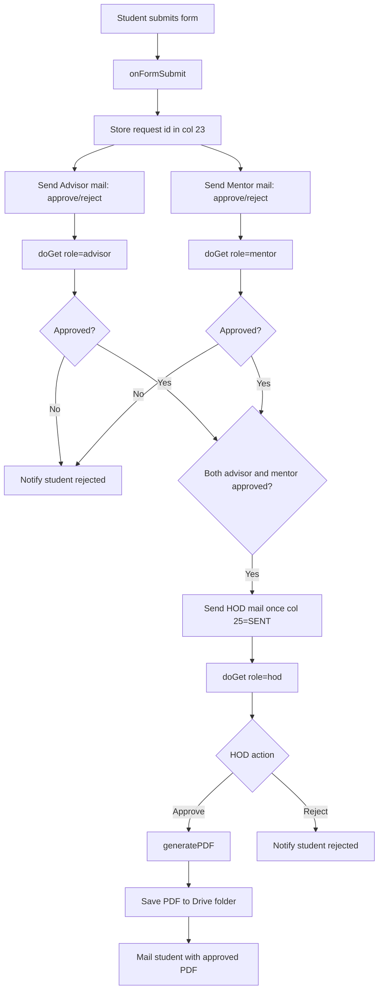

# CampusFlow Leave Automation

<p>
Automated Leave/OD approval workflow built on Google Forms + Sheets + Apps Script + Drive.
This documentation is aligned with the current code in <code>src/leave-od-automation.js</code>.
</p>

## Repository Layout

```text
campusflow-leave-automation/
├── README.md
├── LICENSE
├── .gitignore
├── src/
│   └── leave-od-automation.js
├── docs/
│   ├── system-architecture.md
│   ├── workflow.md
│   └── screenshots/
├── config/
│   └── example-config.js
└── assets/
```

## User Flow (Mermaid)



## What The Script Does Exactly

1. `onFormSubmit(e)` reads latest row and writes workflow metadata.
2. Uses `TEACHERS` map to resolve adviser/mentor emails, with HOD fallback.
3. Writes `col 23` as request UUID.
4. Writes `col 24` as token (currently generated but not validated in `doGet`).
5. Writes `col 26` and `col 27` as resolved adviser/mentor emails.
6. Sends adviser + mentor action links using `SCRIPT_URL` query params.
7. `doGet(e)` records role-based actions and blocks duplicate clicks.
8. Sends HOD mail only once when both adviser and mentor are approved (`col 25`).
9. `generatePDF(row)` fills Google Docs placeholders, applies signature, appends proof, creates PDF, and emails student.

## How To Use (Step-by-Step)

### 1. Prepare Google Form and Sheet

1. Create a Google Form for leave requests.
2. Link responses to a Google Sheet.
3. Keep expected columns consistent with script indices.
4. Required mapping: `2` email, `3` student name, `4` register no, `5` dept, `6` section, `7` semester.
5. Required mapping: `8` request type, `10` reason, `12` from date, `13` to date.
6. Required mapping: `14` proof URL, `15` parent phone, `16` adviser name, `17` mentor name, `18` informed.

### 2. Prepare Template and Drive Files

1. Create a Google Docs template with placeholders:
2. Include placeholders exactly as:
3. `{{DATE}} {{ACADEMIC_YEAR}} {{STUDENT_NAME}} {{REGISTER_NUMBER}} {{BATCH}} {{SEMESTER}} {{REASON}} {{FROM_DATE}} {{TO_DATE}} {{LEAVE_DAY}} {{TOTAL_LEAVE}} {{P_C}} {{PHONE}} {{MENTOR_APPROVED}} {{ADVISOR_APPROVED}} {{HOD_SIGN}}`
4. Create/select output Drive folder for final PDFs.
5. Upload HOD signature file (image).

### 3. Configure Script

1. Open Apps Script from linked Google Sheet.
2. Paste `src/leave-od-automation.js`.
3. Update constants at top:

```js
const TEMPLATE_ID = "YOUR_TEMPLATE_DOC_ID";
const FOLDER_ID = "YOUR_OUTPUT_FOLDER_ID";
const SIGN_ID = "YOUR_SIGNATURE_FILE_ID";
const SCRIPT_URL = "YOUR_WEB_APP_URL";
const HOD_EMAIL = "hod@example.edu";
const INCLUDE_PHONE_IN_APPROVAL_EMAIL = false;
```

4. Fill `TEACHERS` with exact dropdown names from the form.

### 4. Deploy Web App and Trigger

1. Add trigger:
2. Function: `onFormSubmit`.
3. Event source: From spreadsheet.
4. Event type: On form submit.
5. Deploy script as Web App (`Execute as: Me`, access per policy).
6. Copy deployment URL and set `SCRIPT_URL`.
7. Redeploy after updating `SCRIPT_URL`.

### 5. Test End-to-End

1. Submit test form entry.
2. Approve via adviser link and mentor link from emails.
3. Confirm HOD gets escalation mail once.
4. Approve/reject as HOD and verify student notification.
5. On approval, verify PDF in Drive and email attachment delivery.

## Privacy and Data Leakage Controls

<ul>
	<li><code>escapeHtml()</code> sanitizes student-provided values in HTML email blocks.</li>
	<li><code>maskPhone()</code> masks parent phone in approval emails by default.</li>
	<li>Set <code>INCLUDE_PHONE_IN_APPROVAL_EMAIL</code> to <code>false</code> unless policy requires full number sharing.</li>
	<li>Do not commit real IDs/emails; keep only placeholders in repository.</li>
	<li>Use role mailboxes (example: <code>hod-leave@...</code>) instead of personal inboxes.</li>
</ul>

## Additional Docs

1. `docs/system-architecture.md`
2. `docs/workflow.md`


