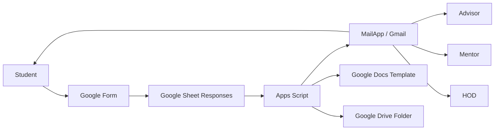
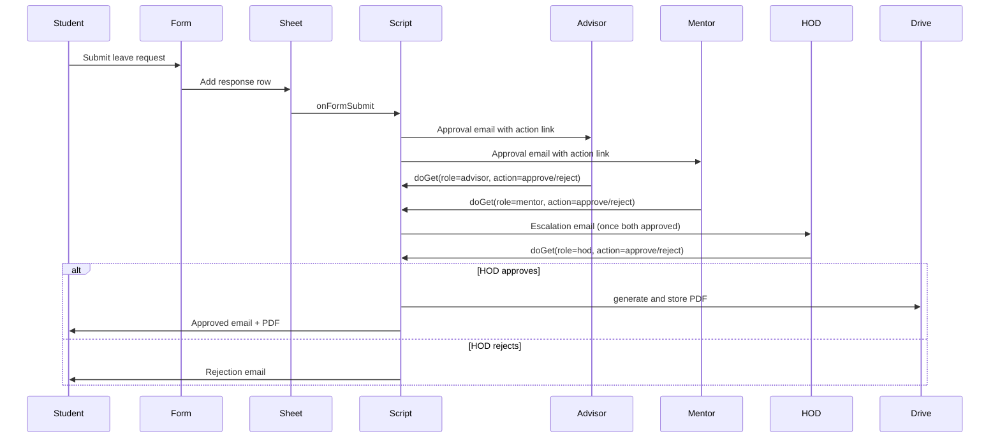

# System Architecture

This document reflects the current implementation in `src/leave-od-automation.js`.

## Component View

## Runtime Flow by Function

### `onFormSubmit(e)`

1. Reads latest response row from active sheet.
2. Calculates leave day count.
3. Generates request ID (`col 23`) and token (`col 24`).
4. Resolves adviser/mentor email and stores in `col 26` and `col 27`.
5. Sends actionable approval emails to adviser and mentor.

### `doGet(e)`

1. Accepts URL params: `id`, `role`, `action`.
2. Locates row by request ID (`data[i][22]`).
3. Writes adviser status to `col 19`.
4. Writes mentor status to `col 20`.
5. Writes HOD status to `col 21` and final status to `col 22`.
6. Sends HOD escalation mail only once when both approvals are complete (`col 25 = SENT`).
7. Triggers `generatePDF(row)` on HOD approve.

### `generatePDF(row)`

1. Copies Docs template into output folder.
2. Replaces all placeholders with row values.
3. Underlines `Leave` or `On Duty/OD` terms based on request type.
4. Replaces `{{HOD_SIGN}}` with signature image.
5. If proof URL is image: appends it into document.
6. If proof URL is PDF: adds it as second email attachment.
7. Exports final PDF to Drive and mails student.

## Sequence Diagram

## Privacy and Security Notes

1. Student input is escaped in HTML mail content via `escapeHtml()`.
2. Parent phone is masked by default via `maskPhone()` and `INCLUDE_PHONE_IN_APPROVAL_EMAIL=false`.
3. Teacher name mismatch falls back to `HOD_EMAIL`, preventing lost approvals.
4. Duplicate actions are blocked by checking existing status cell values.
5. Token (`col 24`) is generated but not yet used for URL validation.
