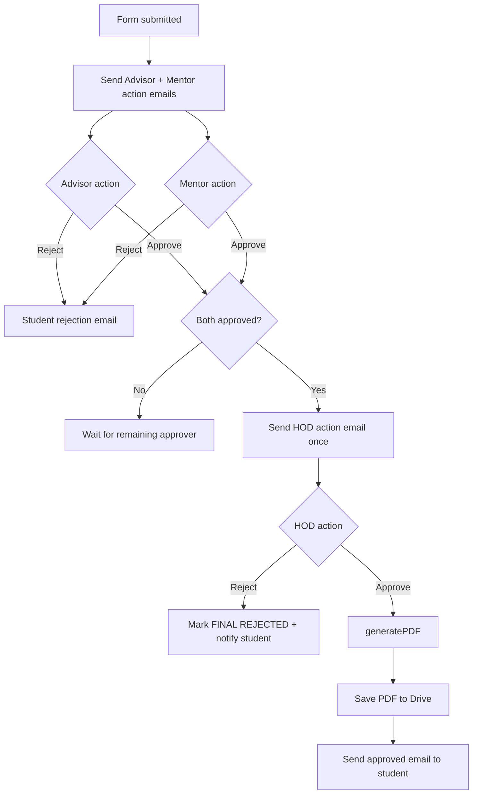

# Workflow

## End-to-End Decision Flow

## Who Does What

1. Student submits Leave/OD request form.
2. Adviser and mentor each click approve/reject from email links.
3. HOD receives request only after both first-level approvals.
4. System generates final letter only on HOD approval.

## Sheet State Transitions

| Column | Meaning | Values Used |
|---|---|---|
| `19` | Adviser status | `Approved` / `Rejected` |
| `20` | Mentor status | `Approved` / `Rejected` |
| `21` | HOD status | `Approved` / `Rejected` |
| `22` | Final status | `FINAL APPROVED` / `FINAL REJECTED` |
| `23` | Request id | UUID |
| `24` | Token | generated (reserved) |
| `25` | HOD mail flag | `SENT` |
| `26` | Adviser email | resolved mail id |
| `27` | Mentor email | resolved mail id |

## Operational Flow (How To Run Safely)

1. Verify `TEACHERS` map matches form dropdown names exactly.
2. Keep `INCLUDE_PHONE_IN_APPROVAL_EMAIL=false` unless policy says otherwise.
3. Confirm Web App URL in `SCRIPT_URL` is latest deployment.
4. Test reject path for adviser, mentor, and HOD at least once.
5. Validate Drive access for template/signature/output folder IDs.

## Failure and Recovery Notes

1. If approver clicks twice, script returns already-responded message.
2. If teacher name is unmapped, fallback email is `HOD_EMAIL`.
3. If proof URL parsing fails, process continues and logs error.
4. If request ID is not found, script returns "Request not found" response.
